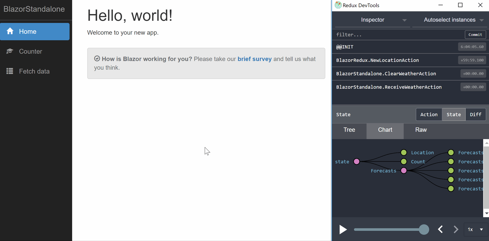

# Blazor Redux

[](https://www.nuget.org/packages/Blazor-Redux/)



This library offers [Redux](https://redux.js.org)-style state management for [Blazor](https://github.com/aspnet/Blazor), with support for both C# and F#. The implementation is based on [Redux.NET](https://github.com/GuillaumeSalles/redux.NET).

The combination of Blazor and Redux becomes an incredibly compelling platform for frontend development&mdash;more compelling than any other alternative, if you ask me:

- Blazor uses .NET, thus comes with a strong type-system built-in, like [Elm](http://elm-lang.org), [Purescript](http://www.purescript.org), [OCaml](https://bucklescript.github.io), and to some degree [Typescript](https://www.typescriptlang.org).
- With ASP.NET already such a viable option for the backend, this opens up for a very strong [isomorphic apps model](https://hackernoon.com/isomorphic-universal-boilerplate-react-redux-server-rendering-tutorial-example-webpack-compenent-6e22106ae285) with shared .NET code on the frontend and backend.
- The Razor view engine combines the power of a templating engine with the familiarity of HTML, like [JSX](https://reactjs.org/docs/introducing-jsx.html). With Redux, the Blazor pages themselves become very simple, with just presentational content, references to state in the store, and dispatching of actions.
- When it comes to productivity, Blazor can feel like one of the specialized proprietary platforms such as Silverlight and Flash, but it does in fact produce web standard-compliant code compatible with all major browsers and devices without any plugins.
- Blazor is actual .NET assemblies running on Mono compiled for WebAssembly. While this may sound excessive in terms of download size, both Mono and the .NET library are less than a megabyte in size.
- Blazor comes with strong backing from a solid organization (Microsoft).

## Advantages over vanilla Blazor

- Implements a one-way model-update-view architecture, by many considered to be [more robust and easier to reason about](https://www.exclamationlabs.com/blog/the-case-for-unidirectional-data-flow/) than a two-way data binding as found in Angular.
- Application state is kept in a single state store, facilitating advanced features such as [undo/redo](https://github.com/elm-community/undo-redo), [hydration of application state](https://github.com/rt2zz/redux-persist), and [time-traveling debuggers](http://debug.elm-lang.org).
- Any Blazor component upgraded to a Redux component will subscribe to changes in the state store and automatically update its view, so you don't have to worry about calling `StateHasChanged()`.
- Blazor Redux supports F#, which means you can take advantage of some advanced language features when designing your types, actions and reducer logic. The [discriminated union types](https://fsharpforfunandprofit.com/posts/discriminated-unions) are perfect for designing type-safe application messages, and [the `with` keyword in record types](https://fsharpforfunandprofit.com/posts/records/) makes it simple to work with immutable types in your reducer logic. Not to mention that a model with many small types can be created with much less ceremony. F# lends itself well to [type driven development](https://fsharpforfunandprofit.com/series/designing-with-types.html). However, the Blazor project itself and the Razor pages must be C#.

## Getting started

Follow these steps, or just open `samples.sln` in this repository and take a look.

1. Assuming you have the [Blazor requirements](https://blazor.net/docs/get-started.html) installed, create a new Blazor project.

2. Add the [Blazor-Redux NuGet package](https://www.nuget.org/packages/Blazor-Redux/).

3. Add some types and actions, and a reducer. See below for details.

4. Open `Program.cs` and configure the Redux store in the `BrowserServiceProvider`:

```csharp
configure.AddReduxStore<MyState, IAction>(new MyState(), Reducers.RootReducer);
```

You will need to add

```csharp
using BlazorRedux;
```

5. Start pulling state and dispatching actions in your Blazor components. See below for details.

## Designing types

### C#

You can basically just add the classes you need, typically with properties. Here's a sample state class:

```csharp
public class MyState
{
    public int Count { get; set; }
    public IEnumerable<WeatherForecast> Forecasts { get; set; }
}
```

### F#

Add an F# class library, and add a reference to it from your Blazor project. You can use F# record types, such as this:

```fsharp
type MyState =
    {
        Count: int;
        Forecasts: WeatherForecast list option;
    }
```

## Designing actions

### C#

It is recommended that you collect all your actions in a file called `Actions.cs`. An action can be as simple as:

```csharp
public class IncrementByOneAction : IAction {}
```

The actions need to have a common base type, which is the one you configure on your store in `Program.cs`. You can use the provided marker interface `IAction`.

You can also have properties on your actions:

```csharp
public class ReceiveWeatherAction : IAction
{
    public IEnumerable<WeatherForecast> Forecasts { get; set; }
}
```

And you can take constructor arguments if you like:

```csharp
    public class IncrementByValueAction : IAction
    {
        public IncrementByValueAction(int value)
        {
            Value = value;
        }

        public int Value { get; set; }
    }
```

### F#

This is where discriminated union types really shine. Just define your actions this way:

```fsharp
type MyMsg =
    | IncrementByOne
    | IncrementByValue of n : int
    | ClearWeather
    | ReceiveWeather of r : WeatherForecast list
```

The common action type is now `MyMsg`, so you will initialize your store in `Program.cs` like this:

```csharp
configure.AddReduxStore<MyState, MyMsg>(
    new MyState(0, null),
    MyFuncs.MyReducer);
```

## Reducer logic

### C#

You can define your reducer logic as follows. Note that we use pattern matching to easily cast the action type and extract parameters such as the `Value` property on `IncrementByValueAction`.

```csharp
public static int CountReducer(int count, IAction action)
{
    switch (action)
    {
        case IncrementByOneAction _:
            return count + 1;
        case IncrementByValueAction a:
            return count + a.Value;
        default:
            return count;
    }
}
```

You can have one big reducer with cases for each of your application actions, or you can break them up and create a root reducer:

```csharp
public static MyState RootReducer(MyState state, IAction action)
{
    return new MyState
    {
        Count = CountReducer(state.Count, action),
        Forecasts = ForecastsReducer(state.Forecasts, action)
    };
}
```

Since C# doesn't have as good support for dealing with immutable types as F# does, breaking up the reducers is a decent way to handle it. It's good practice to leave the incoming state unchanged, and rather return a new object as demonstrated here.

### F#

In F#, a reducer may look like this:

```fsharp
let MyReducer state action =
    match action with
        | IncrementByOne -> { state with Count = state.Count + 1 }
        | IncrementByValue n -> { state with Count = state.Count + n }
        | ClearWeather -> { state with Forecasts = None }
        | ReceiveWeather r -> { state with Forecasts = Some r }
```

Thanks to the `with` keyword, it is easy to create a copy of the state and change some parts of it, without mutating the incoming state. So there is less reason to break the reducer into smaller parts, although you can if you like.

## Blazor components

Time to connect the Redux store with the Blazor components and actually output some HTML. It's helpful if you first define a common base class with your state and action types plugged in:

```csharp
using BlazorRedux;

public class MyAppComponent : ReduxComponent<MyState, IAction>
{
}
```

Here's a basic Blazor page:

```csharp
@page "/counter"
@inherits MyAppComponent
@using BlazorStandalone

<p>Current count: @State.Count</p>
```

## Dispatching actions

In your Blazor components, you can dispatch actions like this:

```csharp
<button onclick=@(() => Dispatch(new IncrementByValueAction(3)))>Click me</button>
```

You can also dispatch actions from C# code blocks, such as in `OnInit()` methods:

```csharp
@functions
{
    protected override void OnInit()
    {
        Dispatch(new IncrementByValueAction(3));
    }
}
```

## Action creators

### C#

None of the methods we have seen so far have been `async`. How do we handle asynchronous tasks such as loading data from a backend? By using action creators. They are called that because they can dispatch several actions during the course of a long-running operation. Here's an example:

```csharp
public static class ActionCreators
{
    public static async Task LoadWeather(Dispatcher<IAction> dispatch, HttpClient http)
    {
        dispatch(new ClearWeatherAction());

        var forecasts = await http.GetJsonAsync<WeatherForecast[]>(
            "/sample-data/weather.json");

        dispatch(new ReceiveWeatherAction
        {
            Forecasts = forecasts
        });
    }
}
```

You can dispatch the operation from a component:

```csharp
@inherits MyAppComponent
@inject HttpClient Http
@using System.Threading.Tasks

@functions
{
    protected override async Task OnInitAsync()
    {
        await ActionCreators.LoadWeather(Store.Dispatch, Http);
    }
}
```

### F#

If you prefer to keep your F# code pure, and just use it to manage your types, actions and reducers, you can certainly keep the action creators in C#. But you can also implement them in F#:

```fsharp
module ActionCreators =
    open System.Net.Http
    open FSharp.Control.Tasks

    let LoadWeather (dispatch: Dispatcher<MyMsg>, http: HttpClient) =
        task {
            dispatch.Invoke(MyMsg.ClearWeather) |> ignore

            let! forecastString = http.GetStringAsync("/sample-data/weather.json") |> Async.AwaitTask
            let forecasts: WeatherForecast list =
                forecastString
                |> Json.parse
                |> Json.deserialize
                
            dispatch.Invoke(MyMsg.ReceiveWeather forecasts) |> ignore
        }
```

The `task` computation expression requires the NuGet package `TaskBuilder.fs`. Also note that we are not using `GetJsonAsync` here, because SimpleJson doesn't understand F# record types. Instead we just download the JSON data as a string, and use [Chiron](https://github.com/xyncro/chiron) to deserialize it. This means we have to add serialization instructions to our record types. See `samples.sln` for details. Alternatively, you could use classes in F# instead of record types. A JSON serialization strategy is needed not just for accessing web APIs, but also for exchanging state data with the Redux DevTools, as we will see in the next section.

## Redux DevTools

Using the Redux DevTools, you can monitor all actions and state changes going on in your app, time travel to any state in the history, save and load state, and reset the application state.

The DevTools can also take care of importing the current state whenever you reload your app. This is similar to Hot Module Replacement, where you can make changes to the app and have the new version automatically repopulate the application state. This is very productive when working on a part of your app that requires a lot of actions in order to get to.

To connect with the Redux DevTools, all you have to do is to add

```
@ReduxDevTools
```

somewhere, such as in the header of `App.cshtml`.

### F#

For F#, you will need to help out with the JSON deserialization, because SimpleJson doesn't understand F# record types, and Mono for WebAssembly doesn't currently support `Reflection.Emit`, which Json.NET and some other libraries depend on. See `samples.sln` for how to handle JSON using Chiron. You will have to connect your serialization helpers in `Program.cs` like this:

```csharp
configure.AddReduxStore<MyState, MyMsg>(
    new MyState("", 0, null), 
    MyFuncs.MyReducer, 
    options =>
{
    options.StateSerializer = MyFuncs.StateSerializer;
    options.StateDeserializer = MyFuncs.StateDeserializer;
});
```

## State-aware routing

If you try time traveling with Redux DevTools now, you will see that you can move back and forth and observe how the app has responded to state changes. But if you have been visiting several pages in your app, the time traveling doesn't show you that. It will stay on whichever page you are at. No problem, because Blazor Redux supports state-aware routing, as long as you decide how to store the location in your state, and give Blazor Redux access to that.

### C#

The location data is typically just an additional string in your state:

```csharp
public class MyState
{
    public string Location { get; set; }
    public int Count { get; set; }
    ...
}
```

You also need to tell Blazor Redux where to find this location data. This enables automatic navigation whenever you change the location state. You do this in `Program.cs`:

```csharp
configure.AddReduxStore<MyState, IAction>(
    new MyState(), Reducers.RootReducer, options =>
{
    options.GetLocation = state => state.Location;
});
```

Next, make sure you add `Location.Reducer` to your `RootReducer`:

```csharp
public static MyState RootReducer(MyState state, IAction action)
{
    return new MyState
    {
        Location = Location.Reducer(state.Location, action),
        Count = CountReducer(state.Count, action),
        ...
    };
}
```

This will work as long as your `RootReducer` operates on `IAction`. If it doesn't, follow the approach described in the F# section below.

### F#

In F# your actions will typically be a discriminated union type and not implement `IAction`, hence the approach is a little different.

You will still add the location as a string to your state:

```fsharp
type MyState =
    { 
        Location: string
        Count: int 
        ...
    }
```

Next, you will implement a separate `LocationReducer`:

```fsharp
let LocationReducer state (action: NewLocationAction) =
    { state with Location = action.Location }
```

Now you need to tell Blazor Redux about the location data and reducer. You do that in `Program.cs` like this:

```csharp
configure.AddReduxStore<MyState, MyMsg>(
    new MyState("", 0, null), 
    MyFuncs.MyReducer, 
    options =>
{
    options.LocationReducer = MyFuncs.LocationReducer;
    options.GetLocation = state => state.Location;
});
```

## Contributing

Blazor Redux is at an experimental stage, and you should expect breaking changes. But I'd be very interested in discussing the design and potential features. Please open an issue if you have any particular topic in mind.
