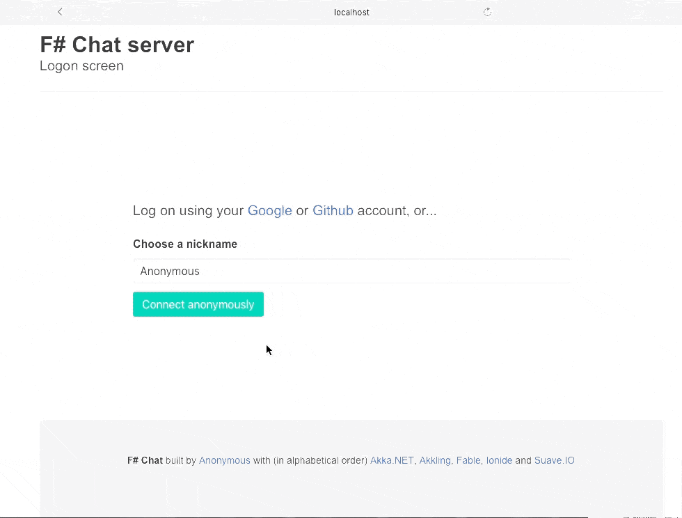

# F#chat

Sample chat application built with netcore, F#, Akka.net and Fable.

## Requirements

* [dotnet SDK](https://www.microsoft.com/net/download/core) 2.0.0 or higher
* [node.js](https://nodejs.org) 4.8.2 or higher
* yarn (`npm i yarn -g`)
* npm5: JS package manager

## Building and running the app

* Install JS dependencies: `yarn`
* **Move to `src/Client` folder**: `cd src\Client`
* Install F# dependencies: `dotnet restore`
* Build client bundle: `dotnet fable webpack -p`
* **Move to `src/Server` folder**: `cd ..\Server`
* Install F# dependencies: `dotnet restore`
* Run the server: `dotnet run`
* Head your browser to `http://localhost:8083/`

## Developing the app

* Start the server (see instruction above)
* **Move to `src/Client` folder**: `cd src\Client`
* Start Fable daemon and [Webpack](https://webpack.js.org/) dev server: `dotnet fable webpack-dev-server`
* In your browser, open: http://localhost:8080/
* Enjoy HMR (hotload module reload) experience

## Running integration (e2e) tests

* Follow the instructions above to start the server
* **Move to `test/e2e` folder**: `cd test\e2e`
* run the tests: `dotnet run`

or, if you love VS Code as much as I do:

* open Integrated Terminal (`Ctrl-~` keyboard shortcut)
* start server by typing `dev-server` (this is for Windows, on Linux it should be `cd src/Server & dotnet run`)
* press F1 and start typing `Expecto`, choose `Expecto: Run` in the dropdown

## Implementation overview

### Authentication

FsChat supports both *permanent* users, authorized via goodle or github account, and *anonymous* ones, those who provide only nickname.

In order to support the google/fb authentication scenario, fill in the client/secret in the CHAT_DATA/suave.oauth.config file. In case you do not see this file, run the server once and the file will be created automatically.

### Akka streams

FsChat backend is based on Akka.Streams. The entry point is a `GroupChatFlow` module which implements the actor, serving group chat.

`UserSessionFlow` defines the flows for user and control messages, brings everything together and exposes flow for user session.

`AboutFlow` is an example of implementing channel with specific purpose, other than chatting

`ChatServer` is an actor which purpose is to keep the channel list. It's responsible for creating/dropping the channels.

`UserStore` is an actor which purpose is to know all users logged in. It supposed to be made persistent but it does not work for some reason (I created issue).

`SocketFlow` implements a flow decorating the server-side web socket.

### Akkling

Akkling is an unofficial Akka.NET API for F#. It's not just wrapper around Akka.NET API, but introduces some cool concepts such as Effects, typed actors and many more.

### Fable, Elmish

Client is written on F# with the help of Fable and Elmish (library?, framework?). Fable is absolutely mature technology, Elmish is just great.

### Communication protocol

After client is authenticated all communication between client and server is carried via WebSockets. The protocol is defined in `src/Shared/ChatProtocol.fs` file which is shared between client and server projects.

## References

* [paket and dotnet cli](https://fsprojects.github.io/Paket/paket-and-dotnet-cli.html)
* [Akkling Wiki](https://github.com/Horusiath/Akkling/wiki)
